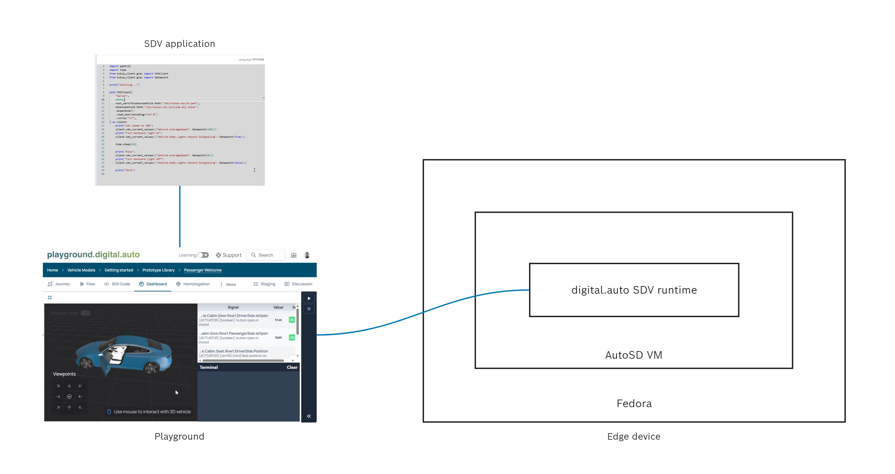
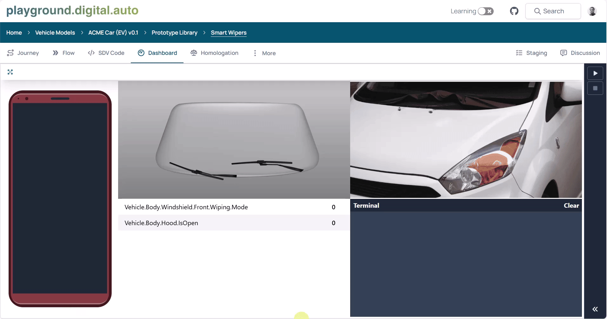

# digital.auto-RIVOS-blueprint
An Integration Blueprint for Rapid SDV Prototyping with digital.auto on Red Hat IVOS

# Introduction
This repository provides a catalyst for building a true cloud-to-car development workflow. It serves as an initial blueprint demonstrating how developers can package a digital.auto application, deploy it to the digital.auto SDV runtime, and execute it within an environment powered by Red Hat's In-Vehicle Operating System (RIVOS). 

The goal is to establish a starting point for a fully integrated toolchain that accelerates the development and validation of mixed-criticality automotive software.

# User journey
| `digital.auto` Playground Workflow                                       | Edge Device Workflow                                                     |
| :----------------------------------------------------------------------- | :----------------------------------------------------------------------- |
| 1. Develops a new SDV application.                                       | 1. Installs RIVOS onto an edge device.                                   |
| 2. Configures the edge device as a new runtime target in the playground. | 2. Integrates the `digital.auto` SDV runtime into the RIVOS environment. |

---

**End-to-End Execution:** The user then executes the application from the playground, deploying it to the new runtime running on the edge device.


# Architecture


# Getting started

## Prerequisites
1. Fedora installation on a machine
   1. The blueprint has been tried on Fedora 43
   2. AutoSD is seen to have connectivity issues with WSL. Hence a discrete device is recommended.

## AutoSD installation
1. AutoSD nightly build images are available [here](https://autosd.sig.centos.org/AutoSD-9/nightly/raw-images/). 
2. Download an image with "qa" suffix. e.g. `auto-osbuild-qemu-autosd9-qa-regular-x86_64-2203174928.e5a9b30b.raw.xz`
3. Unpack the image using `unxz <image>.raw.xz`
4. Install necessary tools to launch the image
  ```sh
      sudo dnf install qemu
      
      sudo dnf copr enable @centos-automotive-sig/osbuild-auto
      sudo dnf copr enable @centos-automotive-sig/automotive-image-builder
      sudo dnf install automotive-image-builder
  ```
5. Launch the AutoSD image using `sudo automotive-image-runner --nographics <image>.raw`
   1. The default login credentials are: `root password`


## Integrate digital.auto SDV runtime on AutoSD
1. Pull the latest digital.auto container using `podman pull ghcr.io/eclipse-autowrx/sdv-runtime:latest`
2. Launch the container using `podman run -d -e RUNTIME_NAME="<name>" ghcr.io/eclipse-autowrx/sdv-runtime:latest`
   1. replace the `<name>` with a runtime name of your choice

## Playground application
1. Choose a pre-existing playground application (e.g. [Smart Wipers](https://playground.digital.auto/model/6729f71665e66f002772b9e3/library/prototype/672dec8115d4fc00270d0a63/view)) or create your own.
2. Expand the right panel and click "Add Runtime"
3. Type in the runtime name created above step "Integrate digital.auto SDV runtime on AutoSD"
4. Click the "Play" button to execute in the new runtime.

# Demo in action

